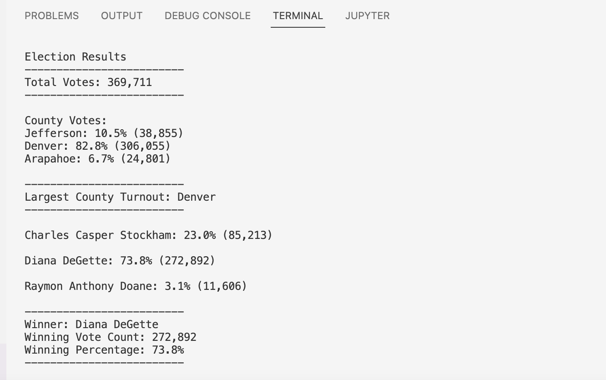

# Election_Analysis

## Election-Audit Overview
A Colorado Board of Elections employee has given the following tasks to complete the election audit of a recent congressional election.
1. Calculate the total number of votes cast.
2. Get a complete list of candidates who received votes.
3. Calculate the total number of votes each candidate received.
4. Calculate the percentage of votes each candidate won.
5. Determine the winner of the election based on popular vote.  
6. Calculate the voter turnout for each county.
7. Calculate the percentage of votes from each county out of the total count.
8. Determine the county with the highest turnout.

## Resources
- Data Source: election_results.csv
- Software: Python 3.7.6, Visual Studio Code 1.70.2
- Requirements of the client.

## Election-Audit Results
  

The analysis of the election shows that:
- There are 369,711 votes cast in the election.
- The counties analyzed for voter turnout were:
  - Jefferson county 
  - Denver county
  - Arapahoe county
- The voter turnout based on county:
  - Jefferson county had 10.5% of the total votes with 38,855 votes cast.
  - Denver county had 82.8% of the total votes with 306,855 votes cast.
  - Arapahoe county had 6.7% of the total votes with 24,801 votes cast.
- The county with the largest number of votes was:
  - **Denver, which received 82.8% of the total votes with 306,855 votes cast.** 
- The candidates were:
  - Charles Casper Stockham
  - Diana DeGette
  - Raymon Anthony Doane
- The candidate results were:
  - Charles Casper Stockham received 23.0% of the votes and 85,213 number of votes.
  - Diana DeGette received 73.8% of the votes and 272,892 number of votes.
  - Raymon Anthony Doane received 3.1% of the votes and 11,606 number of votes.
- The winner of the election was:
  - **Diana DeGette, who received 73.8% of the votes and 272,892 number of votes.**

## Election-Audit Summary
